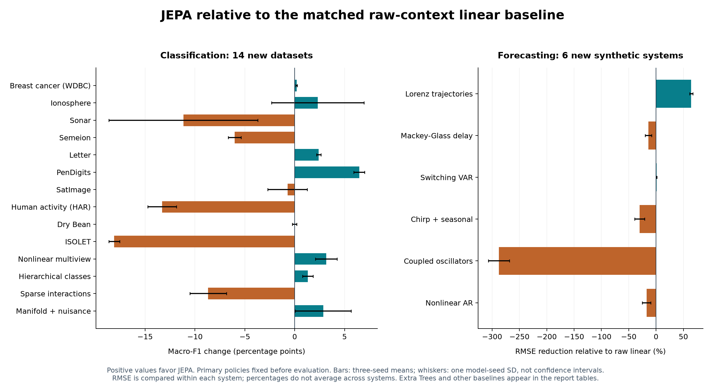
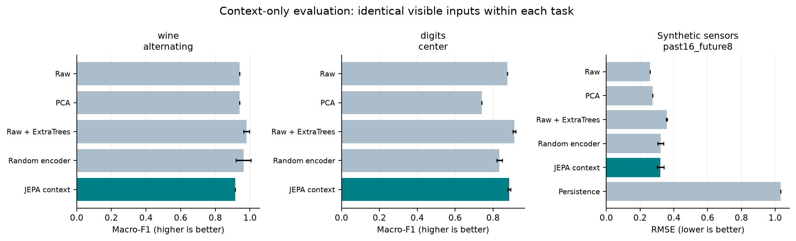

# JEPA-FORGE prototype

A working research prototype for converting scientific datasets into explicit, validated context-target tasks and evaluating a small JEPA-style learner. It implements a bounded technical slice of the foundation-world-model ecosystem proposal.

**Current status: automatic feature-division selection across 23 datasets, 273 new GPU training runs, and 169 passing local tests.** The selector compares **91 equal-budget candidates**, trains each with three seeds for 60 epochs, and chooses by validation performance. All 23 choices are locked before final test evaluation. The selected task's checkpoints are reused for 69 seed evaluations. Together with the separate earlier 138-run fixed-policy study, the project now has **411 full GPU training runs**. Smoke runs are excluded.

The new study independently replayed **273 checkpoints and 273 validation probes**, and reloaded all **23 selected exports**. Selected JEPA representations beat the matched raw linear baseline on **13/23** datasets, Extra Trees on **5/23**, and the random encoder on **12/23**. **198/273 candidate runs trigger the low-rank heuristic.** The task-selection pipeline works; these results do not establish a general JEPA advantage. Classification task selection uses development labels, while encoder training remains label-free. Generic tabular templates require domain review.

- [Automatic selection report and exact feature choices](SELECTION_REPORT.md) · [Selection PDF](output/pdf/JEPA_FORGE_Automatic_Selection_Report.pdf)
- [All selection histories and rankings (gzip JSON)](results/selection_benchmark.json.gz) · [Summary](results/selection_summary.json) · [Independent validation](results/selection_validation.json)
- [Predeclared selection protocol](docs/SELECTION_PROTOCOL.md) · [Privacy audit](SECURITY_AUDIT.md) · [Publication safeguards](SECURITY.md)

The earlier study remains preserved: 18 original runs plus 120 runs on twenty additional datasets. Its 20 predeclared primary tasks beat raw linear on 9/20 and Extra Trees on 3/20; 83/120 runs triggered the low-rank heuristic. Historical and automatic-selection scores use different policies and splits and should not be treated as a controlled before/after improvement claim.

- [Expanded 23-dataset report](EXPANDED_REPORT.md) · [Expanded PDF](output/pdf/JEPA_FORGE_Expanded_23_Dataset_Report.pdf)
- [All expanded per-run evidence (gzip JSON)](results/expanded_benchmark.json.gz) · [240-row summary](results/expanded_summary.json) · [Independent validation](results/expanded_validation.json)
- [Expanded protocol](docs/EXPANDED_PROTOCOL.md) · [10 public sources and sampling](docs/PUBLIC_DATASETS_EXPANDED.md) · [10 synthetic mechanisms](docs/SYNTHETIC_DATASETS_EXPANDED.md)
- [Original three-dataset report](REPORT.md) · [Original results](results/benchmark.json) · [GPU environment](results/environment.json)
- [Independent experiment review](docs/INDEPENDENT_EXPANDED_REVIEW.md) · [Model-quality review](docs/MODEL_QUALITY_REVIEW.md)
- [Architecture](docs/ARCHITECTURE.md) · [Probe/training protocol](docs/EXPERIMENT_PROTOCOL.md) · [Requirements](docs/REQUIREMENTS.md)



The additional public datasets are Breast Cancer (WDBC), Ionosphere, Sonar, Semeion, Letter, PenDigits, Satimage, Human Activity Recognition, Dry Bean, and ISOLET. The ten synthetic families cover Lorenz trajectories, Mackey–Glass-inspired delayed dynamics, switching VAR, chirp/seasonal signals, coupled oscillators, nonlinear autoregression, nonlinear multiview factors, hierarchical classes, sparse interactions, and manifold data with nuisance variables. Public samples contain 208–3,000 rows and up to 617 features; each synthetic dataset has 2,000 rows. Exact sample sizes, partitions, deduplication and missing identifier limitations are documented above.


## What works

1. Inspect typed numeric data, modality/shape, separate labels, groups, intervals and provenance.
2. Propose explicit context-target policies for tabular, spatial and grouped sequence examples.
3. Audit malformed indices, overlap, duplicate observations across splits, declared labels/identifiers in inputs, group/window leakage and forecasting direction. Constant/copy targets produce warnings requiring review.
4. Fit normalization on training rows and export numeric NPZ plus JSON manifests/checksums.
5. Train a masked context encoder, predictor and frozen EMA target encoder on GPU. Context-only inference accepts context columns only.
6. Automatically rank schema-based, budget-matched candidate tasks on development data, write a selection lock, then evaluate the selected task on test.
7. Compare frozen representations against matched raw linear, PCA, random-encoder and ExtraTrees baselines; use persistence for forecasting and a separately labelled full-input classification reference.

This is a **JEPA-style pilot**, with custom small encoders and an explicit variance penalty. It is not an official I-JEPA reproduction. It does not provide graph/audio/event adapters, arbitrary file-format inference, plugin isolation, usability-study evidence or a complete governed ecosystem.

## Install and inspect

```bash
python -m venv .venv
source .venv/bin/activate
python -m pip install '.[dev,report]'
python scripts/run_tests_private.py
python scripts/install_security_tools.py
git config core.hooksPath .githooks

jepa-forge inspect wine
jepa-forge inspect digits
jepa-forge inspect synthetic_sensors
jepa-forge inspect har
jepa-forge inspect synthetic_lorenz
jepa-forge compile digits --task center --output artifacts/compiled/digits-center
jepa-forge verify artifacts/compiled/digits-center
```

Python 3.11+ is supported. `requirements-lock.txt` records the measured macOS environment; `pyproject.toml` supplies portable dependency requirements. CPU unit tests do not require a GPU.

## Automatic task selection on GPU

```bash
jepa-forge select --config configs/selection.json --output artifacts/selection
python scripts/validate_selection.py
python scripts/build_selection_report.py
```

Use a fresh output directory for each run. The selector refuses to overwrite an existing lock. The predeclared study uses data seed 2026, split seed 3026, model seeds 7/17/27, and 60 epochs on the Apple M3 Max via MPS. Images compare spatial halves; sequences compare token blocks; forecasts keep a fixed final-quarter horizon and compare equal-size earlier observations. Classification ranks mean validation macro F1; forecasts rank negative validation RMSE. See the protocol for the three domain measurement groups and four band-pair templates, generic tabular hypotheses, tie rules, and information boundaries.

The API separates development rows before search:

```python
from jepa_forge.datasets import load_dataset, make_splits
from jepa_forge.model import TrainConfig
from jepa_forge.selection import development_data, propose_candidates, select_task

dataset = load_dataset("wine", seed=2026)
splits = make_splits(dataset, seed=3026)
development = development_data(dataset, splits)
candidates = propose_candidates(development.dataset)
lock = select_task(development, [TrainConfig(seed=s, device="mps") for s in (7, 17, 27)],
                   "artifacts/my-selection", candidates)
print(lock["selected_task"])
```

`select_task` accepts only development data and never evaluates test rows. The `select` CLI coordinates the subsequent locked evaluation and baselines. Classification labels fit probes and select tasks, so this is not fully unsupervised feature selection. The feature masks are constrained hypotheses; this prototype does not infer causal importance or guarantee scientific suitability.

## Earlier fixed-policy GPU experiments

```bash
python scripts/verify_environment.py
python scripts/run_experiments.py --config configs/benchmark.json --output artifacts/benchmark
python scripts/validate_artifacts.py
python scripts/build_report.py

# Twenty additional, more complex dataset families:
python scripts/run_experiments.py --config configs/expanded.json --output artifacts/expanded
python scripts/validate_expanded.py
python scripts/plot_expanded.py
python scripts/build_expanded_report.py
```

The fixed benchmark uses three model seeds (`7,17,27`), two policies per dataset, one split/generator seed (`2026`) and 60 epochs. `configs/smoke.json` runs two epochs with one seed to check execution. The supplied configs explicitly request MPS; requested GPU unavailability raises an error. Sandboxed hosts may need permission for GPU device access. For another machine, explicitly set `device` to `cuda` or `cpu` in a copied config and label those results accordingly. The original three-dataset PDF template requires the complete declared MPS benchmark; adapt its compute/template wording for a different benchmark.

Neural training and encoding run on the GPU. Data preparation, covariance diagnostics and scikit-learn estimators run on CPU. No cloud GPU service or paid resource is required.

| Dataset | Shape | Train / validation / test | Primary policy |
|---|---:|---:|---|
| Wine | 178 x 13 | 106 / 36 / 36 | 7 alternating fields -> 6 hidden fields |
| Digits | 1,797 x 64 | 1,078 / 359 / 360 | outer 48 pixels -> central 16 pixels |
| Synthetic sensors | 1,600 x 48 | 960 / 320 / 320 | past 16 steps -> future 8 steps, two channels |

Sensor partitions hold out complete entities: 60/20/20 groups. Wine/Digits use a label-independent random row split. Exact indices and compiler means/scales are saved in local NPZ exports. Probes/PCA estimators are reproduced by refitting the recorded grids, inputs and seeds. The first declared policy is primary a priori; policies have different input/horizon budgets and are not ranked using test scores.

## Original three-dataset primary results

Mean +/- sample standard deviation over three model seeds on one fixed split. F1 is higher-is-better; RMSE is lower-is-better.

| Task / metric | JEPA context + linear | Raw context + linear | Raw context + ExtraTrees |
|---|---:|---:|---:|
| Wine / macro-F1 | 0.914 +/- 0.000 | 0.941 +/- 0.000 | 0.980 +/- 0.018 |
| Digits / macro-F1 | 0.886 +/- 0.008 | 0.875 +/- 0.000 | 0.913 +/- 0.008 |
| Sensors / RMSE | 0.321 +/- 0.021 | 0.259 +/- 0.000 | 0.358 +/- 0.004 |

JEPA improved Digits over the linear context baseline but did not beat ExtraTrees. It underperformed raw-context linear on Wine and sensor forecasting. Sensor persistence RMSE was 1.033. Seven of 18 runs triggered the predeclared low-rank heuristic: all six Wine runs and one 12-step sensor run. These findings support pipeline feasibility and demonstrate why diagnostics and strong baselines are necessary; they do not establish general JEPA superiority.



## Python API and custom data

```python
from jepa_forge.datasets import load_dataset, make_splits, propose_tasks
from jepa_forge.compiler import compile_task, export_task, load_export

dataset = load_dataset("digits", seed=2026)
compiled = compile_task(dataset, propose_tasks(dataset)[0], make_splits(dataset, seed=2026))
export_task(compiled, "artifacts/compiled/digits-center")
restored = load_export("artifacts/compiled/digits-center")
context = restored.X[:, restored.task.context]
```

For a custom numeric dataset, construct `RawDataset`, `TaskSpec` and explicit train/validation/test index arrays through the Python API. Declare labels, identifiers and entity/time metadata correctly; automated checks cannot discover every semantic shortcut. Labels stay separate from the unsupervised task and are used only by downstream supervised probes. Hidden targets never enter context-only inference; they are used in training, forecast supervision, diagnostics and scoring.

## Artifacts and evidence

`results/` contains measured evidence and hashes, including the complete expanded JSON compressed with gzip. Use `gzip.open("results/expanded_benchmark.json.gz", "rt")` with `json.load` to inspect it. `results/original_runtime.zip` and `results/expanded_runtime.zip` preserve the exact historical runtimes. To revalidate the retained expansion after code changes, add `--runtime-archive results/expanded_runtime.zip` to `scripts/validate_expanded.py`; fresh experiments can validate against current source. Large compiled arrays, per-run histories and tensor-only checkpoints are retained under local `artifacts/benchmark/` , `artifacts/expanded/` and `artifacts/selection/`, excluded from Git, and reproducible from source. `scripts/package_artifacts.py` creates a local archive with code, report, public/synthetic compiled arrays and trained checkpoints. Hashes detect changed bytes, not authorship or trusted provenance.

The reports describe limits including tiny test sets, missing writer/speaker/geographic identifiers, synthetic-only forecasting claims, one fixed split and incomplete modality/community support. The proposal's existing numeric results are not reused as measurements here.

Original prototype code is Apache-2.0 licensed. Public datasets retain their own licenses and attribution in [DATASETS.md](docs/DATASETS.md) and [expanded public dataset documentation](docs/PUBLIC_DATASETS_EXPANDED.md).

## Publication and privacy

This repository remains private. Commit and push hooks scan staged files and reachable publication history using a checksum-pinned Gitleaks release and metadata rules, including archive/PDF contents. CI repeats the checks. The audit found no credentials under these scans; two historical test reports contained a personal machine name and were anonymized on the published review branch. Replacing the affected main-branch ancestry is pending explicit approval; the old metadata remains reachable through main. Previously uploaded objects or downloaded copies cannot be guaranteed erased. Native push protection was not offered by the observed repository settings, and GitHub states branch protections are not enforced for this private repository's current account setup. See [SECURITY_AUDIT.md](SECURITY_AUDIT.md) for the exact scope and remaining limits.
