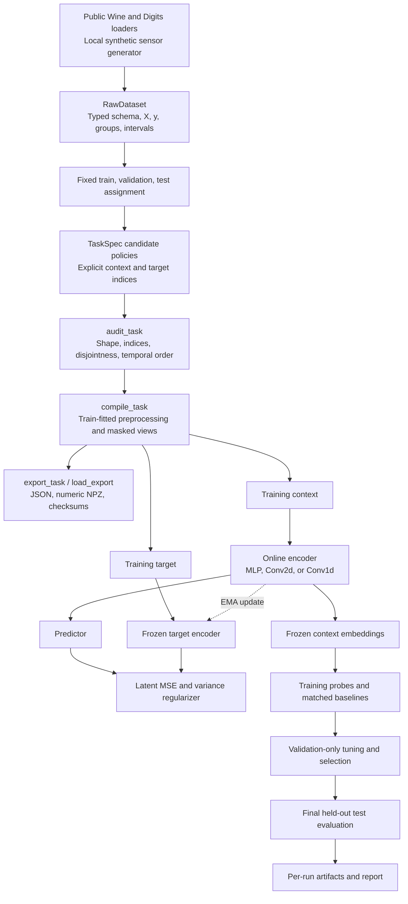

# Prototype architecture

This original diagram describes the intended pilot flow. It is an implementation plan; the requirement status table and actual run artifacts determine which components have been verified.

The compiler establishes what a model may observe. `TaskSpec` is the auditable contract: context and target indices are explicit, disjoint, and appropriate for the modality. The raw dataset retains labels and group/interval metadata for splitting and downstream evaluation; those fields do not become unsupervised model inputs.

The training loop operates on numeric tensors. Tabular data use an MLP; Digits use a spatial encoder with values and an observation mask; sensors use a temporal convolutional encoder over two channels. The online context encoder and predictor receive gradients. The target encoder supplies a stop-gradient target and changes through EMA updates. The loss operates in representation space, while downstream forecasting errors measure original future signal values.

The evaluation layer owns label-dependent probe fitting and validation selection. It compares context-matched raw, PCA, random-encoder, nonlinear, and learned representations. Full-information classification references and sensor persistence are explicitly identified. Test results flow into the final report only after the evaluated configuration is fixed.

Exports use plain JSON metadata and numeric NPZ arrays rather than executable serialization. Checksums detect accidental modification or a payload mismatch; they do not establish a trusted signer. Graph, audio, event, distributed training, and production deployment components are outside this initial architecture.
